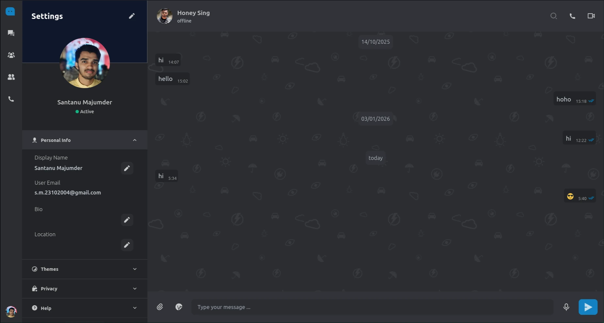
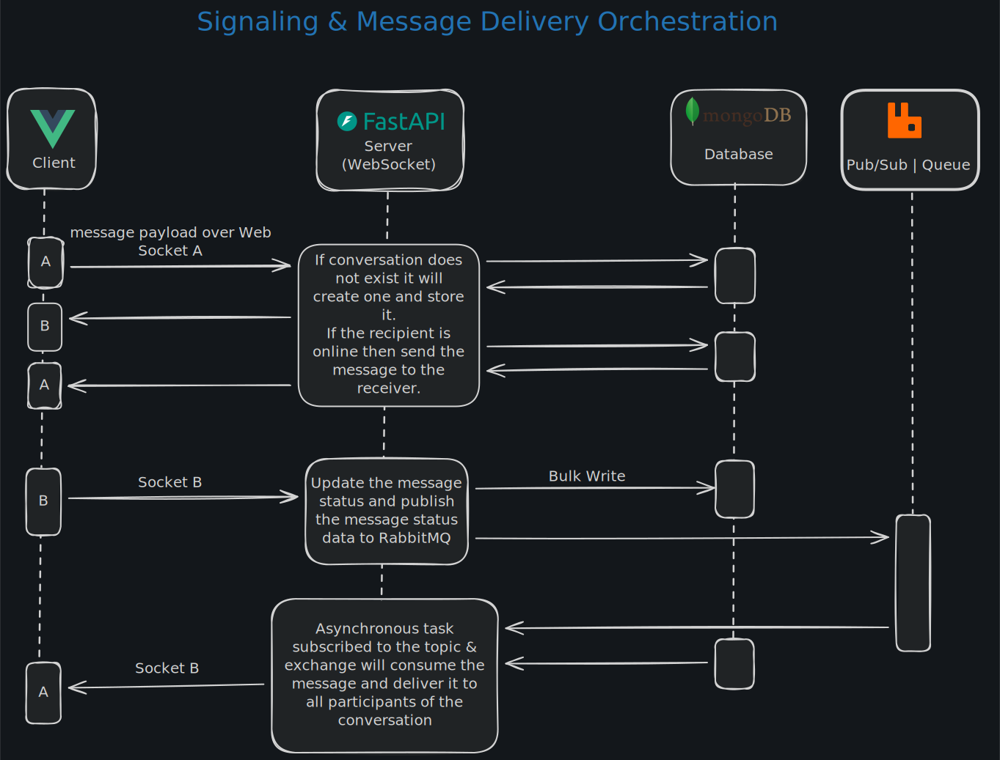

# Bridge-RabbitMQ

Bridge-RabbitMQ is a real-time messaging and voice/video call application.



## Features

- **Real-time Messaging:** Instantaneous text-based communication between users.
- **Voice and Video Calls:** High-quality, low-latency voice and video calls using WebRTC.
- **User Authentication:** Secure user registration and login with email verification.
- **Friend Management:** Users can add and manage their friends.
- **File Sharing**: Users can send files to each other.

## Architecture

The project architecture maintains separation between the frontend client and the backend server.




The backend is built with Python and FastAPI, and it communicates with the frontend client through a combination of REST APIs and WebSockets. RabbitMQ is used as a message broker for asynchronous communication between different parts of the system. It uses Celery to handle heavy background tasks.

## Technologies Used

### Frontend

- **Vue.js:** A progressive JavaScript framework for building user interfaces.
- **Vite:** A fast build tool for modern web projects.
- **IndexedDB**: To store messages and files as a cache.
- **Pinia:** A state management library for Vue.js.
- **Tailwind CSS:** A utility-first CSS framework.

### Backend

- **Python:** A versatile and popular programming language.
- **FastAPI:** A modern, fast (high-performance), web framework for building APIs with Python 3.7+.
- **RabbitMQ:** A popular open-source message broker.
- **MongoDB:** A NoSQL database for storing application data.
- **WebRTC:** For real-time voice and video communication.
- **Celery**: For handling cpu-heavy tasks.

### DevOps

- **Docker:** For containerizing the application and its dependencies.
- **Ansible and Terraform:** For automating the deployment and infrastructure setup.
- **GitHub Actions:** For continuous integration and continuous deployment (CI/CD).

## Setup and Installation

1. **Clone the repository:**

   ```bash
   git clone https://github.com/your-username/Bridge-RabbitMQ.git
   ```

2. **Set up the development environment:**

   ```bash
   cd Bridge-RabbitMQ/development
   docker-compose up -d
   ```

3. **Install frontend dependencies:**

   ```bash
   cd ../client
   pnpm install
   ```

4. **Install backend dependencies:**

   ```bash
   cd ../server
   uv venv
   uv sync
   ```

## Usage

1. **Start the frontend development server:**

   ```bash
   cd client
   pnpm dev
   ```

2. **Start the backend server:**
   `bash
cd server
uvicorn app.main:app --reload
`
   The application will be available at `http://localhost:5173`.
